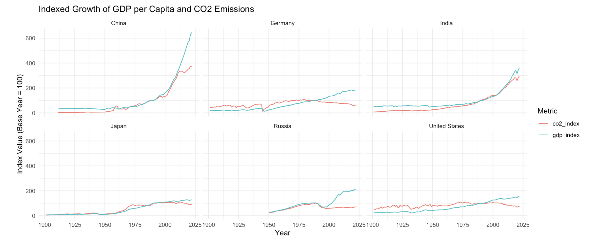

Whenever there is a question of Humanity and it's survival, I am intrigued. Even RPG games like Pokemon where you have to play the role of a Pokemon trainer, catch Pokemon and build your team in order to save the world from monstrous ones (Pokemons) interest me the most.

What also interest me is that, every country in this world today are trying to become a developed country. Whenever you come across the word 'developed country' intuitively you would think tall buildings, massive industries, money flowing left and right. The key proprietor towards this development is actually energy, especially carbon energy. However, carbon energy comes with a lot of consequence.

{fig-align="center" width="1652"}

This data story focuses on how carbon energy has gone hand in hand with economic development but alson how it is not sustainable. The only way to come out of this carbon emission crisis is the massive use of renewable energy. Although fossil fuels/carbon energy still dominate today, how long they will dominate and how soon they take away humanity's trace from the world depends on how quick we start implementing renewable, clean energy.

Story Site: [Story of Humanity's Survival](https://tahmoboi.github.io/energy/)

Github repo: [Repo](https://github.com/tahmoboi/energy)
