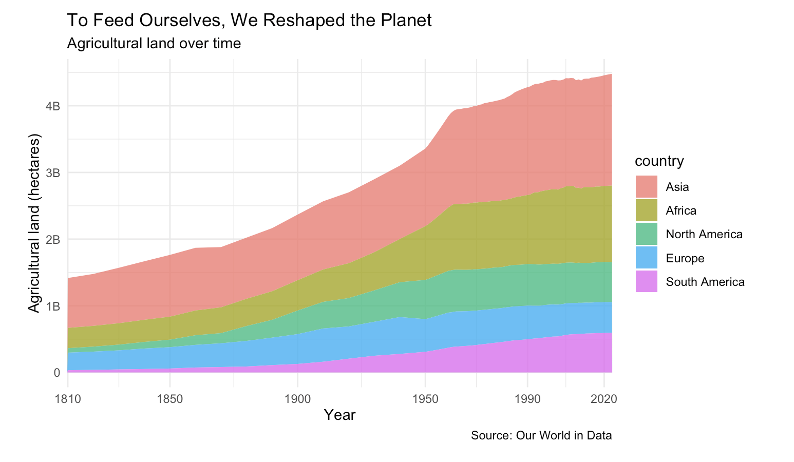

I love to eat. From "Fuchka" of Bangladeshi cuisine, to "Pad Thai" rice-noodles of Thai cuisine, I love food. If I share my food with you, you are either the closest person to my heart or you put a gun on my head.

Just like me(not to my extent), I am pretty sure everyone loves food. However, there are 8 billion people and the earth is only one planet. We are multiplying, eating more which leads to more usage and need for agricultural land.

{fig-align="center" width="1200"}

Question arises: "How are we getting these agricultural lands?"

Simple Answer: Deforestation!

Eventually leading to Global Warming and Climate Change.

This data story focuses on this exact storyline with compact data evidence. This doesn't mean we should stop eating though (I will die not from hunger but from the realization that I won't be able to taste all of the different cuisines the world has to offer), it means: 

**WE SHOULD EAT SUSTAINABLY, STOP WASTAGE AND BE MORE AWARE OF OUR RESPONSIBILITY.**

Story Site: [Earth Eater](https://tahmoboi.github.io/earth_eater/)

Github Repository: [Repo](https://github.com/tahmoboi/earth_eater)

