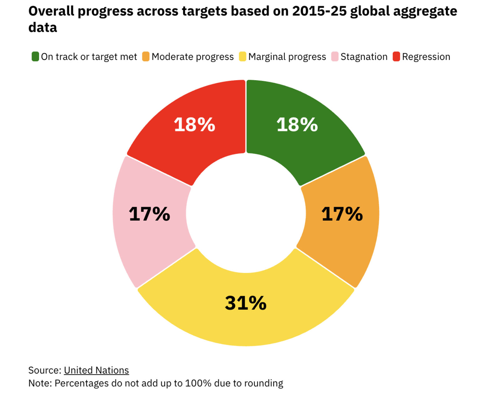

I have seen first hand how much unemployment affects a family and a country. I come from Bangladesh where poverty and unemployment are of the most crucial problems the country has to tackle.

To understand more about these 2 core problems and the plans the world has to remove these problems, I delved deep into SDGs. The history, SDG 1 and 8, the full picture along with the backend reasoning behind these two problems and the future that comes if the current state continues.

{fig-align="center" width="1200"}

If you want to dive deeper into SDG 1 and SDG 8, get the full picture of these 2 SDGs, here is the link you need to click: [SDG 1 & SDG 8 deepdive](https://tahmoboi.github.io/data_story_3/)

Github Reposotory: [Repo](https://github.com/tahmoboi/data_story_3)
