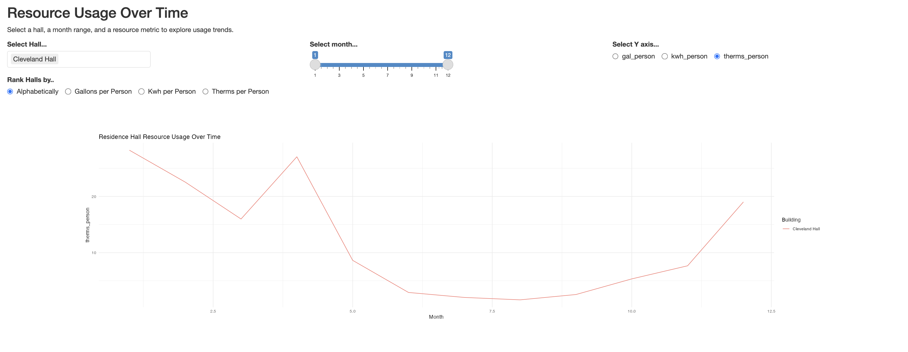

Doctors: Questions to understand Symptoms -\> Determines the Cause -\> Provides accurate Solutions.

This data story makes you a doctor on utility usage. Sewanee, your patient, comes to you with symptoms. You ask questions like:

-   How many gallon per person did you spend in Cannon hall in the month of march to november?

-   Which hall had the minimum kilo watt hour(kwh) per person spent in between September and December?

-   Did you see any unusual change in Cleveland hall for therms per person usage?

    {width="1732"}

Depending on the answers, you figure out causes and thus eventually leading to accurate solutions.

It is massively important to use energy and our resources efficiently if we want to build a sustainable world. Let's start from our surroundings.

Github Repository: [Repo](https://github.com/tahmoboi/sewanee_weather)
