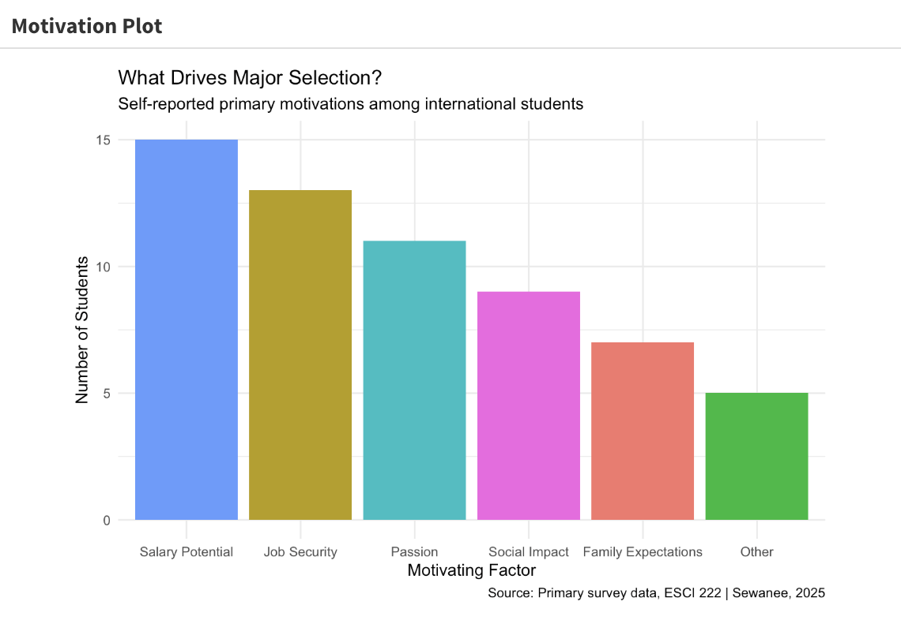

Major choice has been one of the most hardest and strategic decisions I have taken as an international student in the US. I believe most if not every international student struggle with their major selection. Passion vs Salary dilemma weighs highest in this decision phase.

If the world removed career, ambition, goals from my life, I would choose psychology/philosophy as my major. But because the world isn't as lenient, I chose to major in Economics and Data Science with a minor in Business because it aligned partly with my passion, job expectation, salary potential and STEM designation subject.

This data story explores the major choices of international students in Sewanee, their motivations behind major and expectations after graduation with their major. Lastly, how confident they are with their major.

{fig-align="center"}

For internationals, STEM designated subjects which has high job possibility is the most important factor. Majority of Sewanee international students want to do grad school and become more knowledgable in their particular field of studies before they join workforce.

Github Repository: [Repo](https://github.com/tahmoboi/shiny_fullstack)
